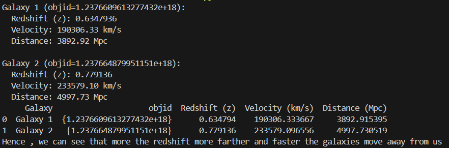

<h2>Redshift Analysis of Galaxies using Astropy</h2

This Python Program reads astronomical red shift data from a csv file of kaggel dataset , uses the redshift values to analyze the velocity with which it is moving away from us and how far the galaxy is from us.

 Dataset used - https://www.kaggle.com/datasets/fedesoriano/stellar-classification-dataset-sdss17 
File used - star_classification.csv

- Reads the dataset of 2 galaxies from .csv file
- Removes negative and empty redshift values(we only consider moving away from us)
- Calculates velocity using redshift and speed of light from astropy
- Calculates luminous distance using Planck 18 model 
- Compares both the data by creating a table

Output:

