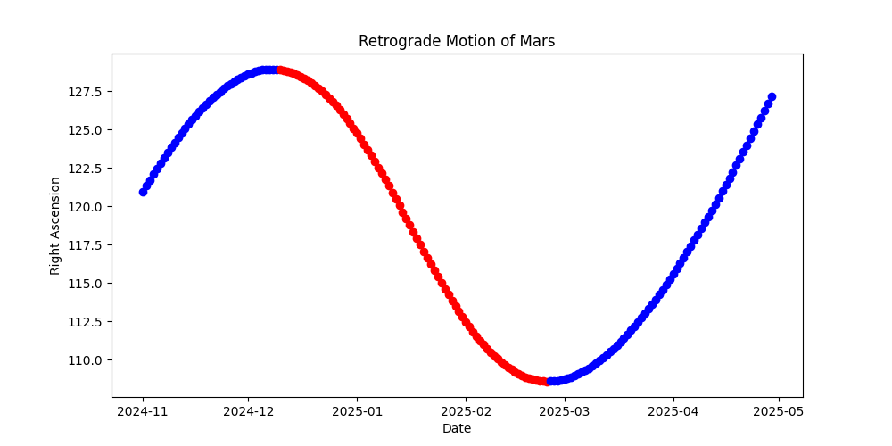

<h2>Retrograde Motion</h2>
What is Retrograde motion? 
<li>Retrograde Motion is when a planet appears to be moving backward in night sky evenn though it is moving formward in space
 <li>In short terms , it's apparent backward motion of outer planets with respect to us
<li>This happens because , earth orbits faster than planets that are farther from the Sun , when Earth passes one of these outer planets, the planet seems to move backward in the sky for a short time.  

Program Structure:
- This program visualises retrograde motion of mars
- It reads right assertion data from NASA's JPL ephemeris data
- Creates a list of days when the planet undergo retrograde motion
- Plots a graph of right assertion value in degrees vs time , highlights the retrograde days in red colour

Output:
