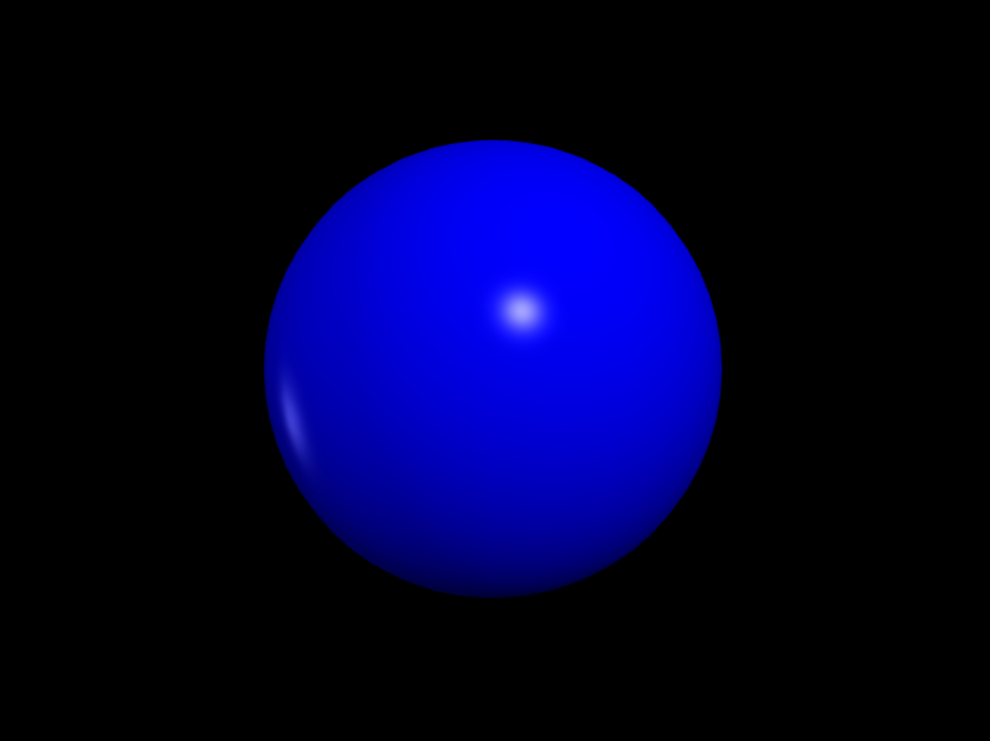

<h2>Ideas to stimulate Astronomical Bodies</h2>
<ol>
<li>Using VPython module : This is the best and simplest way to stimulate astronomical bodies , quality is comparitively less but easy to code
<li>Genesis Engine : We can use this engine to stimulate high quality bodies but difficult to exexute
<li>Using Blender's API inside Python

<h2>Process :</h2>
<ol>
<li>First I explored the genesis library
<li>Then I tried to execute the sample code
<li>I tried to install genesis in python , but I had python 13.3 which do not suppot genesis
<li>To deal with that error , I created a virtual environment which worked on python 10.0
<li>I installed Taichi and Genesis in venv
<li>Now I ran the program , and the error showed 'too many values to be unpacked' 
<li>Then I understood we have to install another module named pyigl which cannot be installed by pip
<li>So , next I researched and got to know that I have to create a conda virtual environment which had puthon 10.0 version
<li>I installed all the modules again but the error continued</li>
<li>The engine doesnt work on windows , so I had to do everything again on Ubuntu</li>
<li>In my ubuntu I had to install cuda-nvdia packages for the gpu to work</li>
<li>My Lynux had python 3.12.6 on which genesis-world works</li>
<li>so i again created a venv in ubuntu , then installed pytorch , taichi and genesis world again and executed the code</li>

<h2>Output:</h2>

